# AWS CloudFormation example creates and installs Nginx on an EC2 instance.

## Table of contents

- [1. Requirements](#1-requirements)
- [2. Implementation steps](#2-implementation-steps)
    - [2.1 Create S3 bucket for CloudFormation template](#21-create-s3-bucket-for-cloudformation-template)
    - [2.2 Copy CloudFormation template files to S3 bucket](#22-copy-cloudformation-template-files-to-s3-bucket)
    - [2.3 Run root stack](#23-run-root-stack)
        - [2.3.1 SSH key import result](#231-ssh-key-import-result)
        - [2.3.2 VPC result](#232-vpc-result)
        - [2.3.3 Internet Gateway result](#233-internet-gateway-result)
        - [2.3.4 Route Table result](#234-route-table-result)
        - [2.3.5 Public Subnet result](#235-public-subnet-result)
        - [2.3.6 Security Group result](#236-security-group-result)
        - [2.3.7 EC2 instance result](#237-ec2-instance-result)
        - [2.3.8 Nginx result](#238-nginx-result)
    - [2.4 Clean everything](#24-clean-everything)
        - [2.4.1 Delete root stack](#241-delete-root-stack)
        - [2.4.2 Delete S3 bucket](#242-delete-s3-bucket)
- [3. Software version](#3-software-version)
- [4. Reference information](#4-reference-information)

This CloudFormation example will do the following:
- Create an S3 bucket to store the CloudFormation template.
- Import SSH key available from local machine instead of creating a new one.
- Create a VPC located in the Singapore region.
- Create Internet Gateway and attach it to VPC.
- Create Route Table and add necessary routes for public subnet.
- Create a public subnet that supports both IPv4 and IPv6.
- Create a Security Group with built-in rules for ports:
    - SSH from fixed IP.
    - Allow ICMP Ping request.
    - Allow HTTP access from internet.
- Create an EC2 instance and automatically install the Nginx webserver.

**<ins>NOTE</ins>: This example is written in the form of "nested stacks", which means breaking down the resources that need to be created into small stacks in CloudFormation. Instead of writing it all into a single template file. This is great for production systems.**

## 1. Requirements

You need to install the AWS CLI and perform key configuration on your computer. Check and make sure your IAM account has enough permissions to do work from CLI.

Refer: [https://docs.aws.amazon.com/cli/latest/userguide/getting-started-install.html](https://docs.aws.amazon.com/cli/latest/userguide/getting-started-install.html)

## 2. Implementation steps

After you clone this repository to your local machine, follow these steps.

### 2.1 Create S3 bucket for CloudFormation template

Create an S3 bucket to store the CloudFormation (CF) template. This is required when you write CF in nested stacks. Then, the required `TemplateURL` value calls to the file path located on the S3 bucket. You cannot call the local path here.

Run this command:

Replace the following values with yours:
- `--profile devopslite`: AWS CLI profile name on your machine, in case you only use 1 profile `Default`, you can remove this option.
- `--stack-name devopslite-s3-cf-template`: rename the stack to the name you want.

```sh
aws cloudformation create-stack --profile devopslite --template-body file://s3-cf-template/main.yaml --stack-name devopslite-s3-cf-template
```

After running the command, you can check the S3 result similar to the one below.

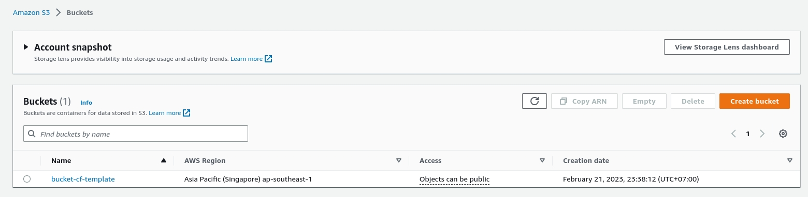

### 2.2 Copy CloudFormation template files to S3 bucket

Once you have the S3 bucket, you need to put all the template files in this repository into the bucket.

Run the command below to do that.

```sh
aws s3 cp --profile devopslite . s3://bucket-cf-template/ --exclude ".git/*" --recursive
```

During use, if you have any changes in the template, run this command again to make sure the template files are updated to the bucket.

We could consider using CI tools to do this automatically, but that's not within the scope of this example.

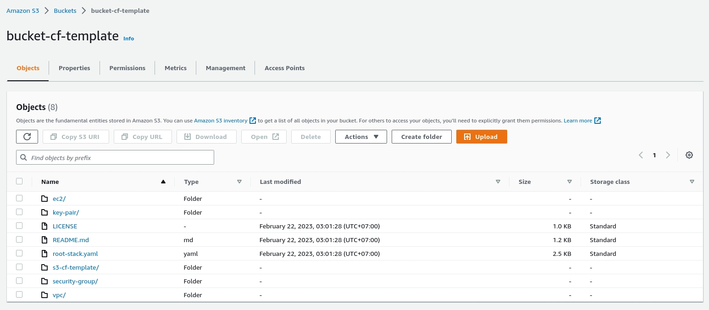

### 2.3 Run root stack

Now, you just need to run the command below to create the root stack.

```sh
aws cloudformation create-stack --profile devopslite --template-body file://root-stack.yaml --stack-name devopslite-stack
```

Similar to when you create a stack for your S3 bucket, change the profile and stack name as you wish.

You will have to wait a long time for the stack to finish its work, maybe 5-10 minutes. The result will look like the image below.

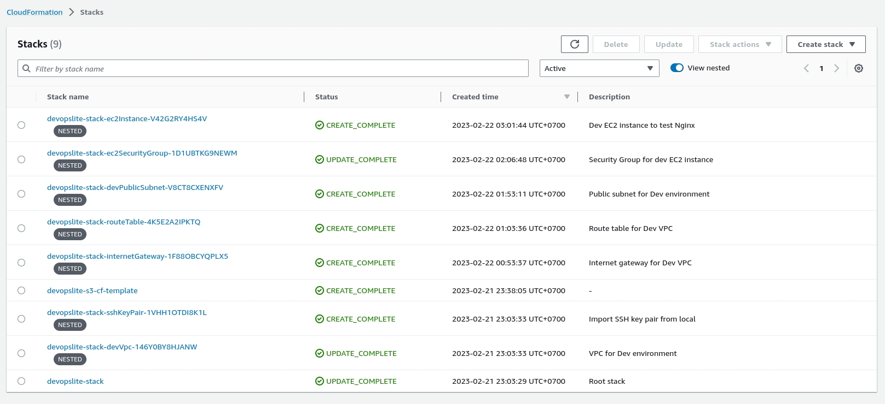

In case you change something in the template files, after you have uploaded the new file to the S3 bucket, run the command below to update the root stack. It will update your changes to the resource.

```sh
aws cloudformation update-stack --profile devopslite --template-body file://root-stack.yaml --stack-name devopslite-stack
```

**<ins>WARNING</ins>: Because this is just an example of using CloudFormation and it is quite simple, there is no danger in using the command `aws cloudformation update-stack`. However, for production systems, you need to check the `change set` before performing the update.**

Refer: [https://docs.aws.amazon.com/AWSCloudFormation/latest/UserGuide/using-cfn-updating-stacks-changesets.html](https://docs.aws.amazon.com/AWSCloudFormation/latest/UserGuide/using-cfn-updating-stacks-changesets.html)

Below is a snapshot of CloudFormation's performance, which you can compare with yours.

#### 2.3.1 SSH key import result

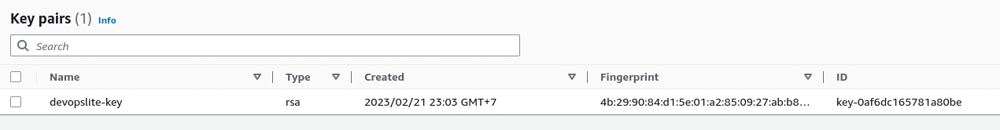

#### 2.3.2 VPC result

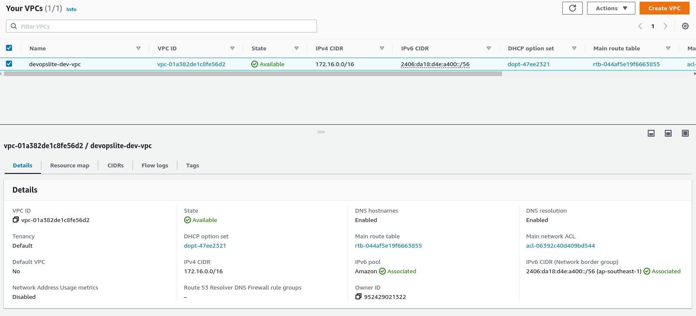

#### 2.3.3 Internet Gateway result

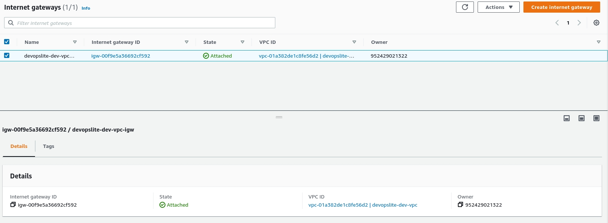

#### 2.3.4 Route Table result

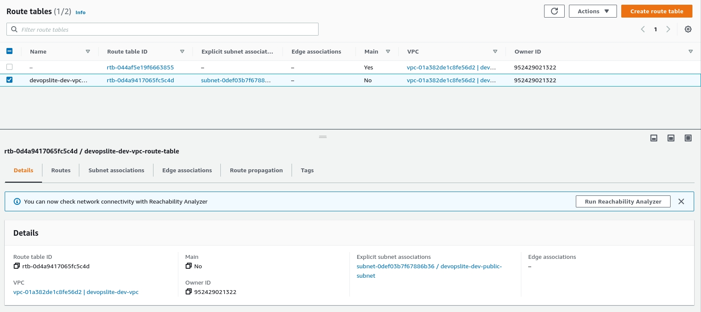

#### 2.3.5 Public Subnet result

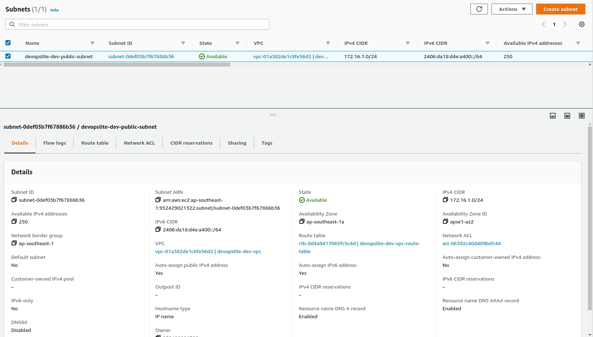

#### 2.3.6 Security Group result

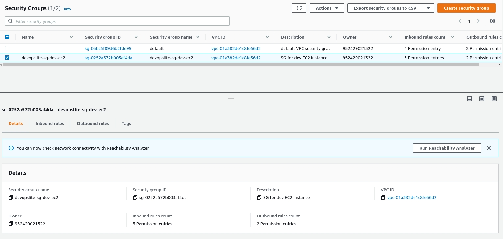

Here you will probably see that the SG I created will only allow port 22 SSH for the public IP from my computer. I also recommend you do the same.

You can use below command to get public ip quickly.

```sh
curl ifconfig.io
```

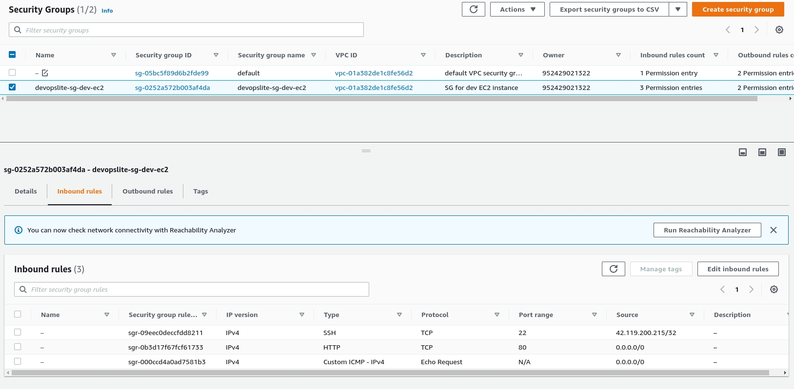

#### 2.3.7 EC2 instance result

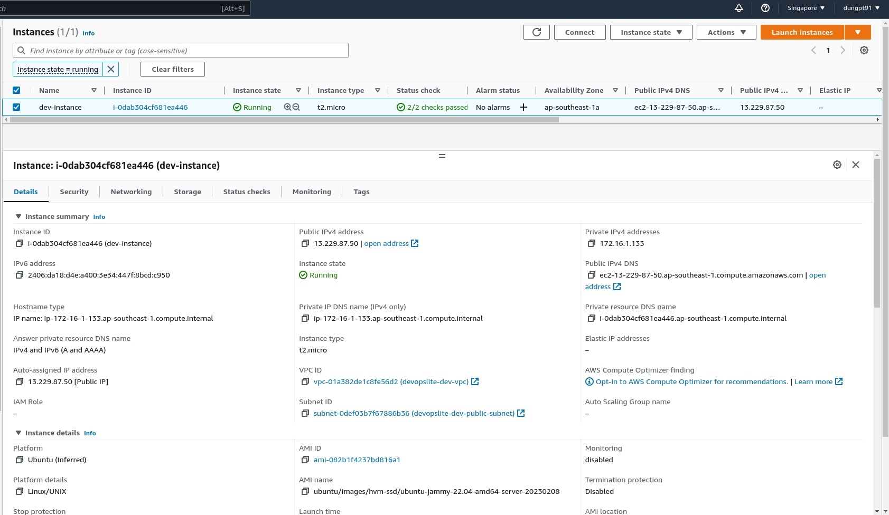

You can view the EC2 instance's public DNS through instance details, or you can view it through the instance creation stack. In my example, I will open the `Outputs` tab of the stack named `devopslite-stack-ec2Instance-V42G2RY4HS4V`.

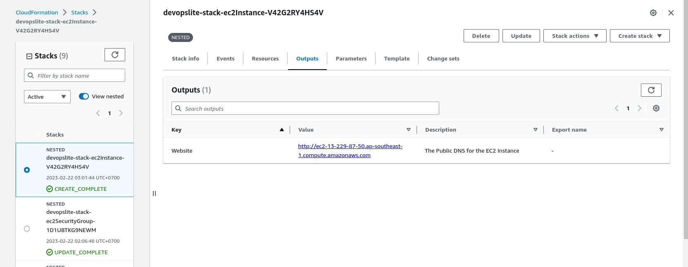

#### 2.3.8 Nginx result

Now, if you copy the DNS found in the above step, access it in the browser and the result is similar to the image below, that means everything is successful.

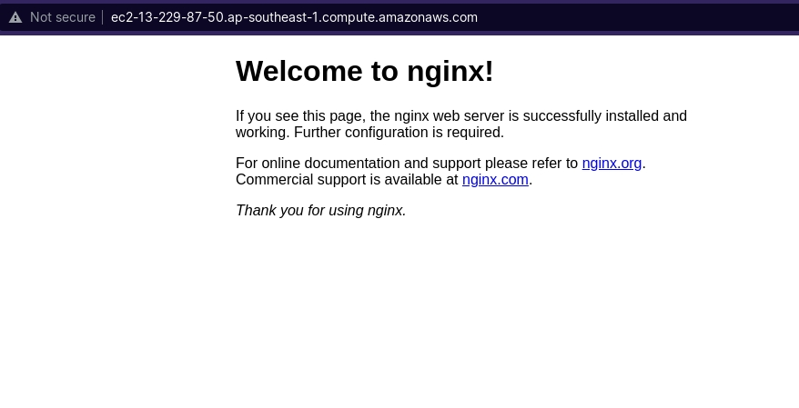

### 2.4 Clean everything

After you're done testing, delete all stacks on CloudFormation to avoid spending money without you noticing.

#### 2.4.1 Delete root stack

```sh
aws cloudformation delete-stack --profile devopslite --stack-name devopslite-stack
```

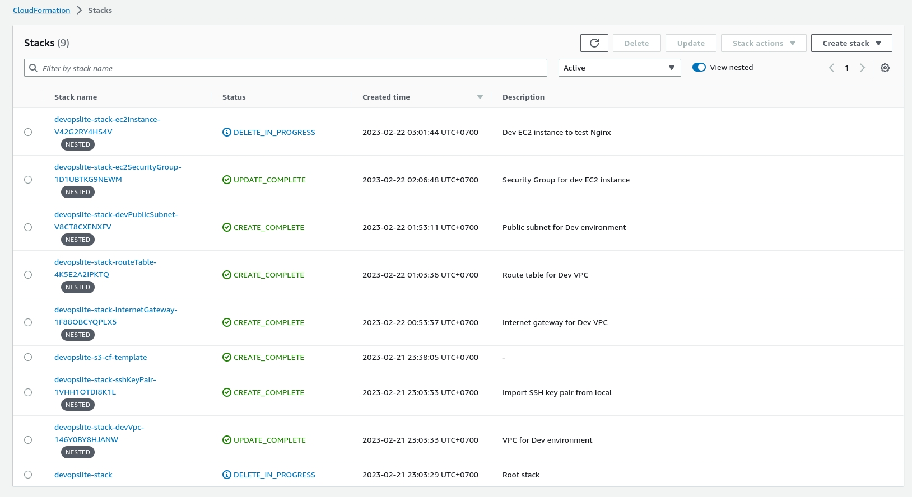

Clearing all resources and stacks on CloudFormation can take a few minutes. For me it was about 3-4 minutes.

#### 2.4.2 Delete S3 bucket

Because by default, the S3 bucket cannot be deleted without deleting the objects inside it. Run the command below with CLI to delete all objects inside the bucket.

```sh
aws s3 rm --profile devopslite s3://bucket-cf-template --recursive
```

And finally, delete the stack to create S3 with the bucket.

```sh
aws cloudformation delete-stack --profile devopslite --stack-name devopslite-s3-cf-template
```

## 3. Software version

| Software | Version |
|---|---|
| AWS CLI | 2.7.12 |

## 4. Reference information

- [https://curiousorbit.com/blog/aws-cloudformation-nested-stacks](https://curiousorbit.com/blog/aws-cloudformation-nested-stacks)
- [https://docs.aws.amazon.com/AWSCloudFormation/latest/UserGuide/aws-template-resource-type-ref.html](https://docs.aws.amazon.com/AWSCloudFormation/latest/UserGuide/aws-template-resource-type-ref.html)
- [https://docs.aws.amazon.com/AWSCloudFormation/latest/UserGuide/using-cfn-nested-stacks.html](https://docs.aws.amazon.com/AWSCloudFormation/latest/UserGuide/using-cfn-nested-stacks.html)
- [https://docs.aws.amazon.com/cli/latest/reference/cloudformation/index.html](https://docs.aws.amazon.com/cli/latest/reference/cloudformation/index.html)
